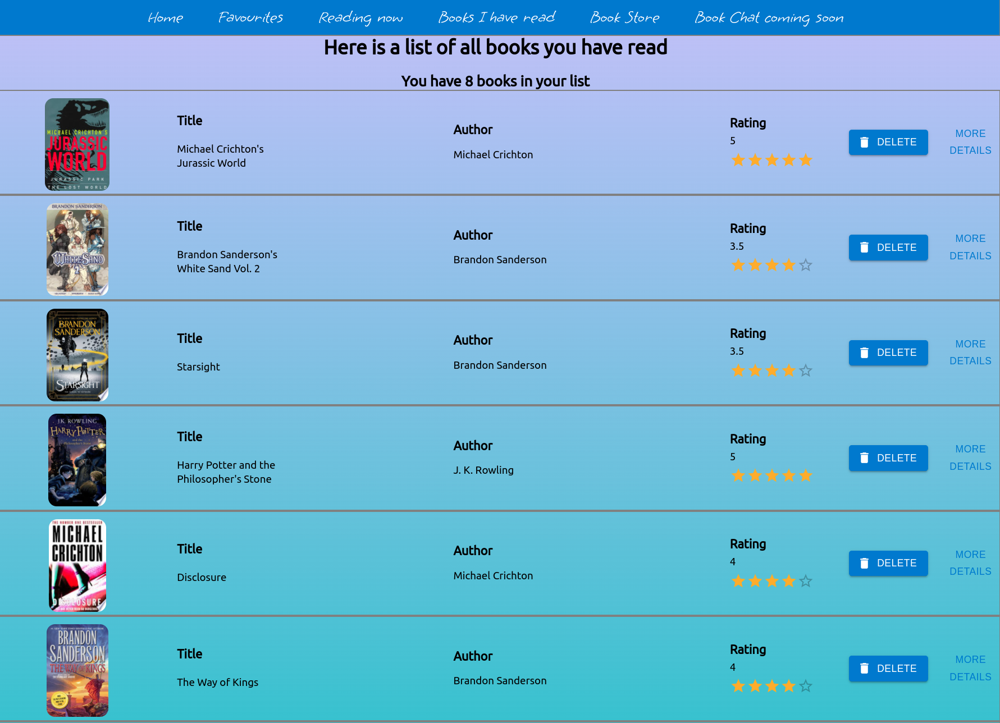

# Book-Worm

A book managing app, which allows users to discover new books/authors and manage existing books. 
## Table of contents

  - [Screenshot](#screenshot)
  - [Built with](#built-with)
  - [How to install](#how-to-install)
  - [Next steps](#next-steps)
- [Author](#author)

### Screenshot

#### Desktop

### Built with

## How to install

* Download repo and cd into API folder and run npm i and run node server.js.
*  cd into my-vite-app folder and run npm i react-router-dom@5.3 @react-google-maps/api.
* Then npm run dev.
* Once both server and client are running you will be directed to the Bookworm hompage.

PORT used for authentication and client should be 3000
Server PORT is 5150

## Next Steps
* Will be adding google places to map to allow users locate nearest bookstore
* Will be adding chat feature to allow users who are logged in to chat with each other to discuss books.

## Author

- Linkedin - www.linkedin.com/in/tyrone-kong
